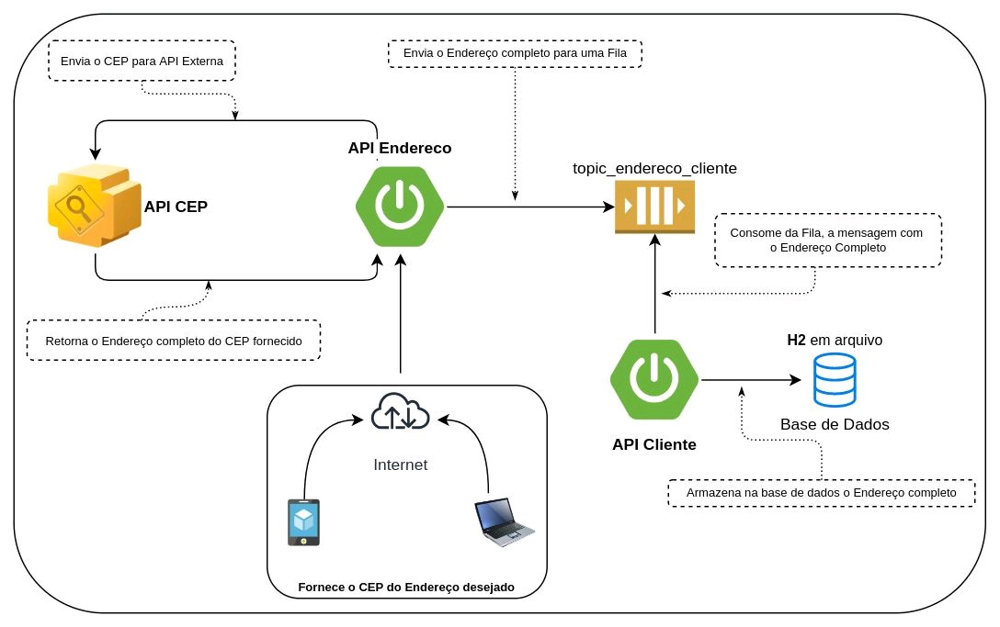

<h1 align="center">Kafka Playground</h1>

Project developed to better understand how microservices work.

##

* [Installation](#Installation)
* [Endpoint](#Endpoint)
* [Architecture](#Architecture)
* [Technologies Used](#technologies-used)

## Installation

#### Prerequisites

Before starting, make sure you have Docker installed on your machine.

```bash
# Clone this repository
$ git clone git@github.com:rafaelzorn/kafka-playground.git

# Access the docker folder at the root of the project
$ cd docker

# Run the installer.sh script
$ ./installer.sh
```

When running the ``installer.sh`` script it will execute the following commands:

- docker-compose -p kafka_playground up -d
- docker exec customer_api_application supervisorctl reread
- docker exec customer_api_application supervisorctl update
- docker exec customer_api_application supervisorctl start address-api-new-address:*
- sh ../address-api/docker/installer.sh
- docker exec address_api_application cp .env.example .env
- docker exec address_api_application composer install
- docker exec address_api_application php artisan key:generate
- docker exec address_api_application vendor/bin/phpunit tests/Integration/ --testdox
- sh ../customer-api/docker/installer.sh
- docker exec customer_api_application cp .env.example .env
- docker exec customer_api_application composer install
- docker exec customer_api_application php artisan key:generate
- docker exec customer_api_application php artisan migrate
- docker exec customer_api_application vendor/bin/phpunit tests/Unit/ --testdox

## Endpoint

```
    http://localhost:8000/api/v1/address
```

##### Examples Payload

```
    # Search full address
    {
	    "zip_code": "93115446",
    }
```

## Architecture



## Technologies Used

- [Laravel 9.19](https://laravel.com/)
- [Apache Kafka](https://kafka.apache.org/)
- [Supervisor](http://supervisord.org/)
- [Laravel-kafka](https://junges.dev/documentation/laravel-kafka/v1.8/1-introduction)
- [Guzzle](https://github.com/guzzle/guzzle)
